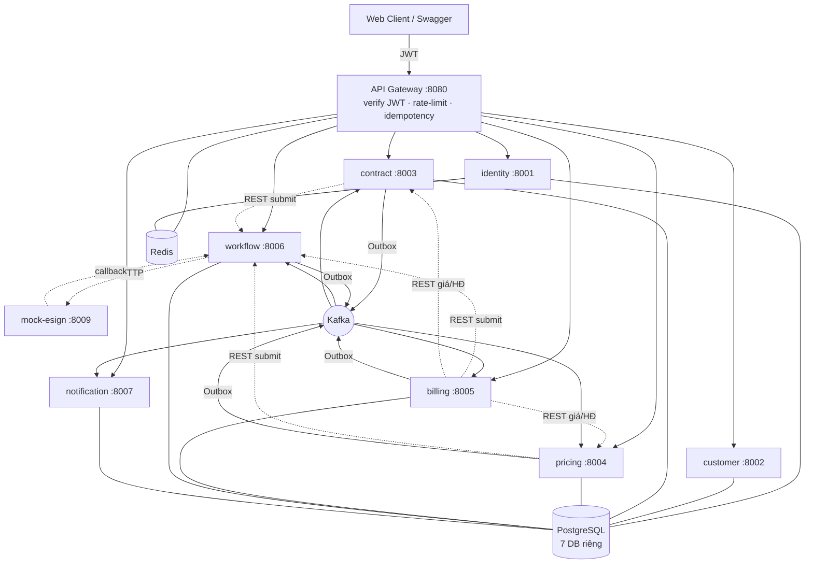
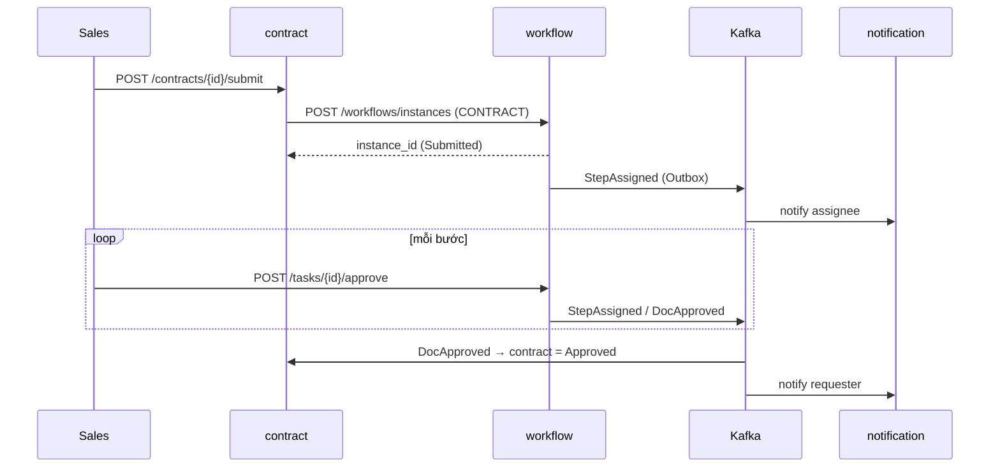
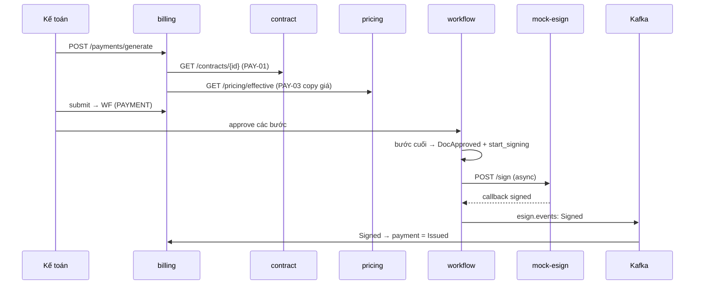

# Kiến trúc hệ thống

## 1. Sơ đồ thành phần

## 2. Kênh giao tiếp
- **Đồng bộ (REST)**: UI→Gateway→service; service→workflow khi submit; billing→contract/pricing khi lập bảng thanh toán.
- **Bất đồng bộ (Kafka + Outbox)**: mọi thay đổi trạng thái phát event → notification (thông báo + audit), và propagate kết quả duyệt/ký về service sở hữu hồ sơ.

## 3. Topic Kafka
`contract.events`, `pricing.events`, `billing.events`, `workflow.events`, `esign.events`.

## 4. Sequence — Duyệt hợp đồng

## 5. Sequence — Bảng thanh toán + ký điện tử

## 6. Quyết định thiết kế
- **DB-per-service**: 1 cụm Postgres, mỗi service 1 database → cô lập dữ liệu, nhẹ tài nguyên.
- **Workflow data-driven**: quy trình lưu trong bảng (`workflow_definitions/step_defs`), engine đọc DB → không hard-code if/else theo loại hồ sơ.
- **Outbox Pattern**: đảm bảo "ghi DB + phát event" nguyên tử, chống mất event.
- **Zero-trust nội bộ**: mỗi service vẫn tự verify JWT dù đã qua gateway.
