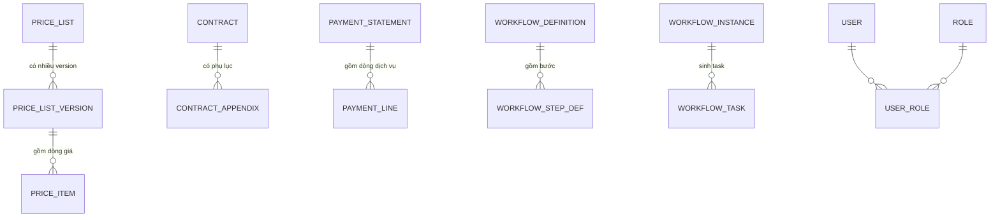

# Mô hình dữ liệu (DB-per-service)

Mỗi service sở hữu database riêng; không FK xuyên service (liên kết bằng mã: `customer_code`, `contract_code`, ...).

## authdb (identity)
`users(id, username, full_name, department, password_hash, is_active)`, `roles(code, name)`, `user_roles`.

## customerdb (customer)
`customers(code, name, tax_code, customer_type, address, representative, contact, status)`,
`services(code, name, unit)`.

## contractdb (contract)
`contracts(code, customer_code, title, effective_from, effective_to, value, status, workflow_instance_id, ...)`,
`contract_appendices(id, contract_code, title, content, effective_date, status)`, `outbox`.

## pricingdb (pricing)
`price_lists(code, name, customer_code)`,
`price_list_versions(id, price_list_code, version_no, effective_from, effective_to, status)`,
`price_items(id, version_id, service_code, unit_price)`, `outbox`.

## billingdb (billing)
`volume_records(id, customer_code, service_code, record_date, period, quantity, locked)`,
`payment_statements(id, code, customer_code, contract_code, period, status, subtotal, tax, total)`,
`payment_lines(id, statement_id, service_code, quantity, unit_price, amount)`, `outbox`.
> `payment_lines.unit_price` được **copy cứng** tại thời điểm tính (PAY-03).

## workflowdb (workflow)
`workflow_definitions(doc_type, name)`, `workflow_step_defs(id, doc_type, step_order, step_name, assignee_role, assignee_username)`,
`workflow_instances(id, doc_type, doc_id, status, current_step_order, version_id)` — `version_id` cho optimistic lock,
`workflow_tasks(id, instance_id, step_order, assignee_username, status, acted_by, comment)`,
`signing_sessions(id, doc_type, doc_id, status, provider_ref, attempts)`, `outbox`.

## notifdb (notification)
`notifications(id, recipient, title, body, doc_type, doc_id, is_read)`,
`audit_logs(id, ts, actor, action, doc_type, doc_id, detail)`.

## ERD (quan hệ chính trong từng service)

## Liên kết logic xuyên service
`contract.customer_code → customer.code` · `price_list.customer_code → customer.code` ·
`payment.contract_code → contract.code` · `workflow.doc_id → {contract.code | version.id | payment.id}` ·
`notification.recipient → user.username`.
