

  
TRƯỜNG ĐẠI HỌC KHOA HỌC TỰ NHIÊN

  
KHOA CÔNG NGHỆ THÔNG TIN

  

  <h1 class="cover-title">HỆ THỐNG QUẢN TRỊ KINH DOANH</h1>
  
Đồ án thực hành — Kiến trúc Microservices

  

  
<b>Môn học:</b> Ứng Dụng Phân Tán (UDPT)

  <table class="cover-people"><tr>
  <td><b><i>Sinh viên thực hiện:</i></b> 
  Vũ Huyền Thiên Lý (21126028) 
  Nguyễn Tuấn Kiệt (21126027) 
  Nguyễn Hoàng Danh (21126057) 
  Nguyễn Thế Thanh Long (22127247)</td>
  <td><b><i>Giáo viên hướng dẫn:</i></b> 
  Nguyễn Trường Sơn 
  Phạm Minh Tú</td>
  </tr></table>
  
TP. Hồ Chí Minh, tháng 9 năm 2026

  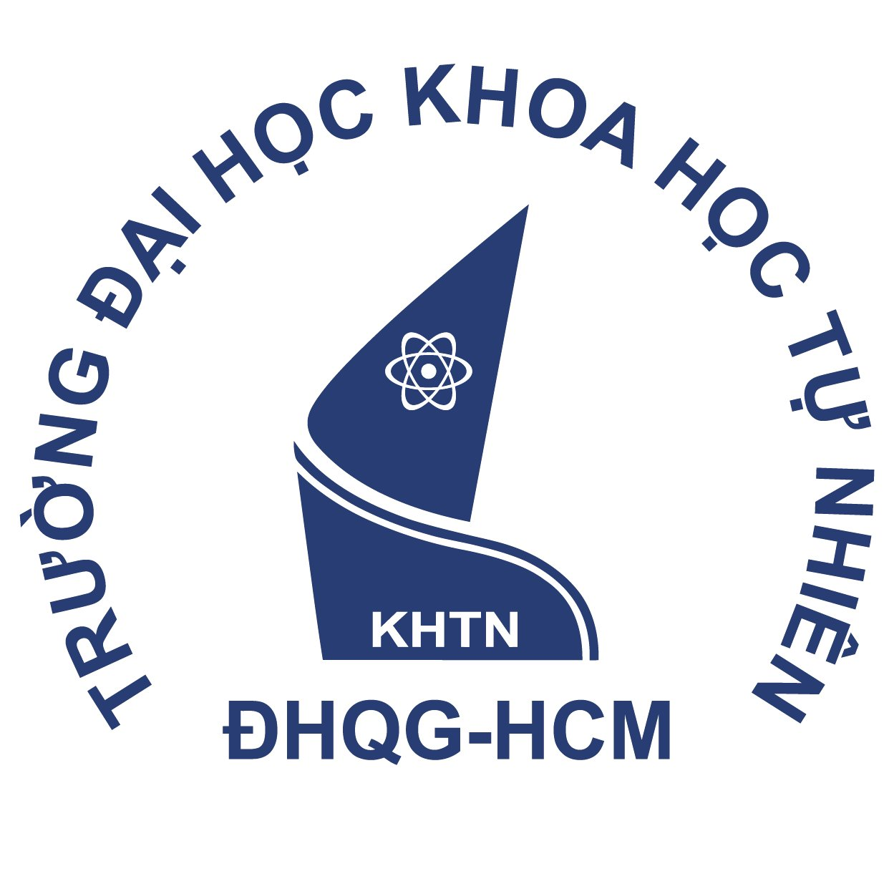
  
Mã nguồn: <a href="https://github.com/lizly15/UDPT">github.com/lizly15/UDPT</a>

## Bảng phân công công việc

<table>
<thead>
<tr><th>MSSV</th><th>Họ tên</th><th style="width:1%;white-space:nowrap">Tỷ lệ</th><th>Công việc phụ trách</th></tr>
</thead>
<tbody>
<tr><td>21126028</td><td style="white-space:nowrap">Vũ Huyền Thiên Lý</td><td style="text-align:center">35%</td><td>Kiến trúc; Gateway, Identity, Contract, Pricing, Workflow, Notification; hạ tầng &amp; kiểm thử; báo cáo &amp; slide</td></tr>
<tr><td>21126057</td><td style="white-space:nowrap">Nguyễn Hoàng Danh</td><td style="text-align:center">15%</td><td>Backend: Customer, Billing, Mock e-sign</td></tr>
<tr><td>21126027</td><td style="white-space:nowrap">Nguyễn Tuấn Kiệt</td><td style="text-align:center">25%</td><td>Frontend: khung ứng dụng + Khách hàng, Dịch vụ, Hợp đồng, Bảng giá</td></tr>
<tr><td>22127247</td><td style="white-space:nowrap">Nguyễn Thế Thanh Long</td><td style="text-align:center">25%</td><td>Frontend: Sản lượng, Thanh toán, Phê duyệt, Thông báo, Nhật ký, Quản trị</td></tr>
</tbody>
</table>

## 1. Giới thiệu & phạm vi

Công ty logistics ABC cần một hệ thống tập trung quản lý **vòng đời hồ sơ kinh doanh**: khách hàng → hợp đồng → phụ lục → bảng giá → sản lượng → bảng thanh toán → phê duyệt → **ký điện tử**, kèm **thông báo bất đồng bộ** và **nhật ký truy vết**. Hệ thống thay thế quy trình thủ công (email/Excel) vốn phân tán, khó kiểm soát trạng thái và truy vết.

Đồ án hiện thực theo **kiến trúc microservices** với đầy đủ yêu cầu kỹ thuật: API Gateway, ≥4 service nghiệp vụ, PostgreSQL (DB riêng mỗi service), Redis, Kafka, Docker Compose, Kubernetes, JWT, OpenAPI.

## 2. Kiến trúc tổng thể

Hệ thống gồm **9 service** (6 nghiệp vụ + identity + gateway + mock-esign) chạy độc lập; giao tiếp **đồng bộ (REST)** cho lệnh tức thời và **bất đồng bộ (Kafka + Outbox)** cho lan truyền sự kiện.

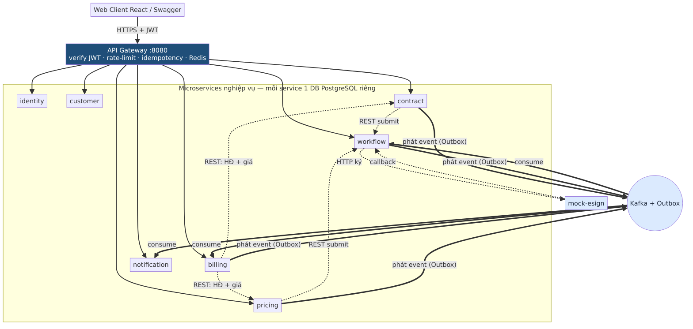

*Hình 2.1 — Kiến trúc: Gateway điều phối & xác thực; các service gọi nhau qua REST cho lệnh, phát/nhận sự kiện qua Kafka (Outbox); mock-esign xử lý ký bất đồng bộ.*

| Service | Port | Database | Vai trò |
|---|---|---|---|
| api-gateway | 8080 | — | Reverse proxy, verify JWT, rate-limit, idempotency |
| identity-service | 8001 | authdb | User, role, JWT (access/refresh), blacklist |
| customer-service | 8002 | customerdb | Khách hàng + danh mục dịch vụ |
| contract-service | 8003 | contractdb | Hợp đồng + phụ lục (CTR-01..07) |
| pricing-service | 8004 | pricingdb | Bảng giá + version (PRC-01..06) |
| billing-service | 8005 | billingdb | Sản lượng + bảng thanh toán (PAY-01..07) |
| workflow-service | 8006 | workflowdb | Engine phê duyệt data-driven + điều phối ký (APR) |
| notification-service | 8007 | notifdb | Thông báo + audit log |
| mock-esign | 8009 | — | Nhà cung cấp ký điện tử giả lập (async callback) |

## 3. Công nghệ sử dụng
- **Backend:** FastAPI + SQLAlchemy 2 + Pydantic v2 (Python 3.12); OpenAPI/Swagger tự sinh.
- **CSDL:** PostgreSQL 16 — 1 cụm, **mỗi service 1 database riêng**.
- **Bất đồng bộ:** Apache Kafka (KRaft) + **Outbox Pattern** (confluent-kafka).
- **Cache/Điều tiết:** Redis (rate-limit, idempotency-key, JWT blacklist).
- **Xác thực:** JWT (access + refresh) + RBAC 7 role.
- **Frontend:** React + Vite + TypeScript + TailwindCSS.
- **Hạ tầng:** Docker Compose (dev) + Kubernetes manifests (minikube).

## 4. Thiết kế dữ liệu

Áp dụng **Database-per-Service**: cô lập dữ liệu, không FK xuyên service (liên kết bằng mã nghiệp vụ). Điểm quan trọng: `payment_lines.unit_price` được **copy cứng** tại thời điểm tính phí (PAY-03) để bảng thanh toán không đổi khi bảng giá thay đổi về sau.

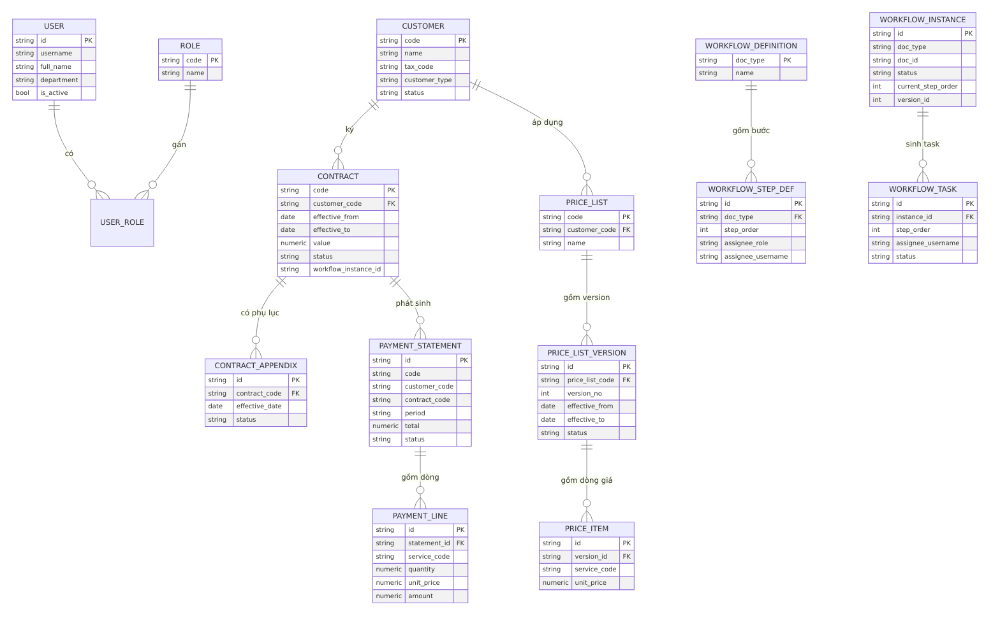

*Hình 4.1 — Mô hình dữ liệu các thực thể chính và quan hệ (theo từng service).*

## 5. Chi tiết service & API

Mỗi service tự sinh tài liệu **OpenAPI/Swagger** tại `/docs`. Danh sách endpoint đầy đủ xem `docs/api.md`.

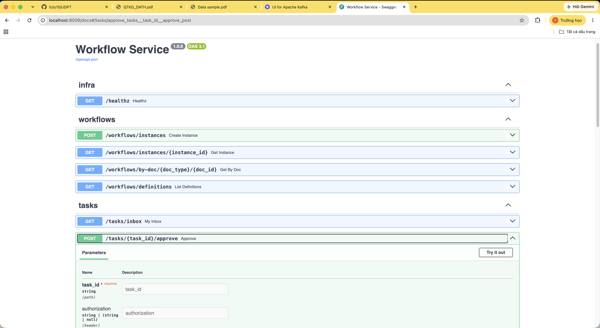

*Hình 5.1 — Swagger (OpenAPI 3.1) tự sinh của workflow-service.*

## 6. Luồng nghiệp vụ trọng tâm

**6.1. Duyệt hợp đồng (4 cấp):** Kinh doanh submit → contract tạo workflow (REST) → duyệt lần lượt Trưởng phòng KD → Pháp chế → Kế toán → Giám đốc → workflow phát `DocApproved` (Outbox→Kafka) → contract chuyển `Approved` → kích hoạt `Active`.

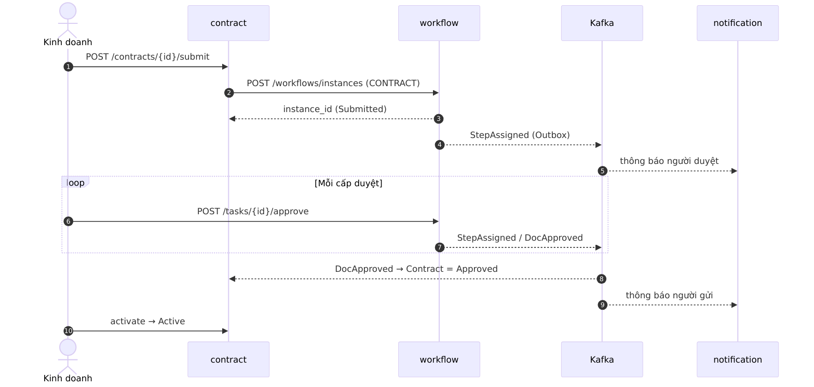

*Hình 6.1 — Trình tự duyệt hợp đồng (đồng bộ cho lệnh, bất đồng bộ cho kết quả).*

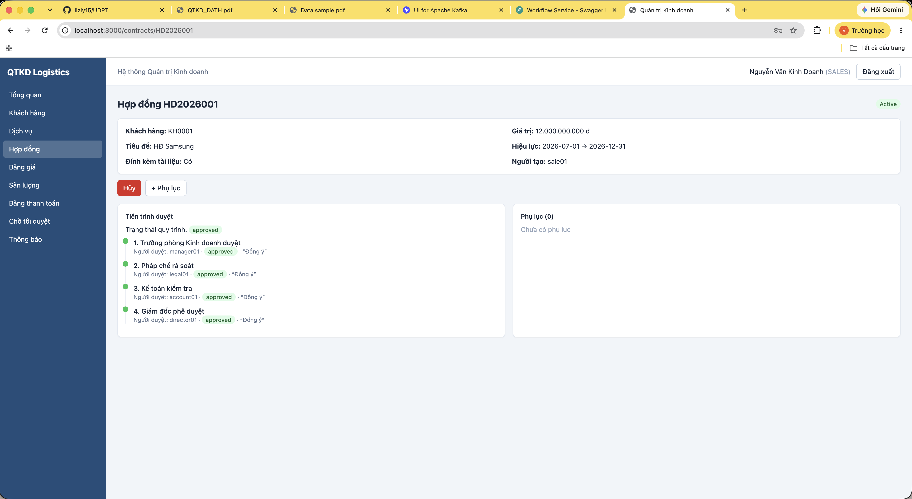

*Hình 6.2 — Chi tiết hợp đồng HD2026001 với tiến trình duyệt 4 cấp đã hoàn tất.*

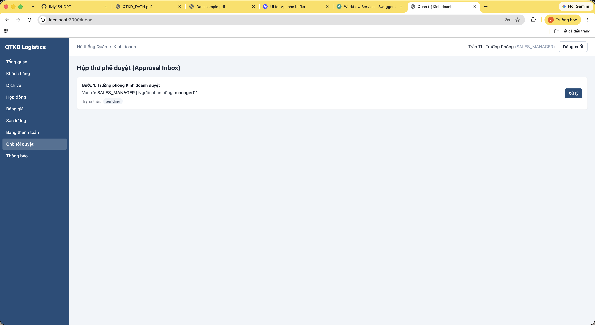

*Hình 6.3 — Hộp thư phê duyệt: chỉ đúng người được giao ở bước hiện tại mới thấy tác vụ (APR-01).*

**6.2. Bảng thanh toán + ký điện tử (bất đồng bộ):** Kế toán lập bảng thanh toán (billing gọi contract kiểm hiệu lực + pricing lấy & copy đơn giá) → submit → duyệt → workflow tự khởi động ký → mock-esign callback → `Signed` → billing chuyển `Issued`.

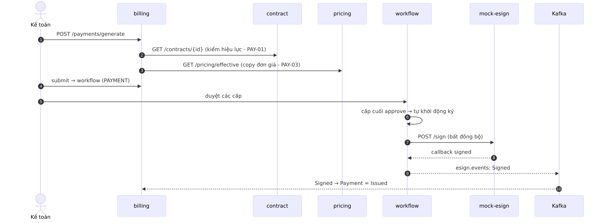

*Hình 6.4 — Trình tự lập bảng thanh toán và ký điện tử bất đồng bộ.*

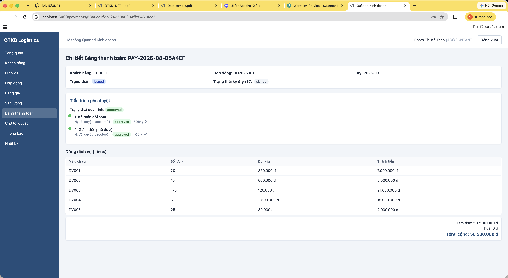

*Hình 6.5 — Bảng thanh toán tháng 08/2026 khớp chính xác Phụ lục A.8 (tổng 50.500.000đ), trạng thái Issued, ký điện tử signed.*

## 7. Minh chứng chức năng nghiệp vụ (giao diện)

Giao diện web hiện thực đầy đủ các chức năng mục 4, minh chứng bằng dữ liệu thật đã seed.

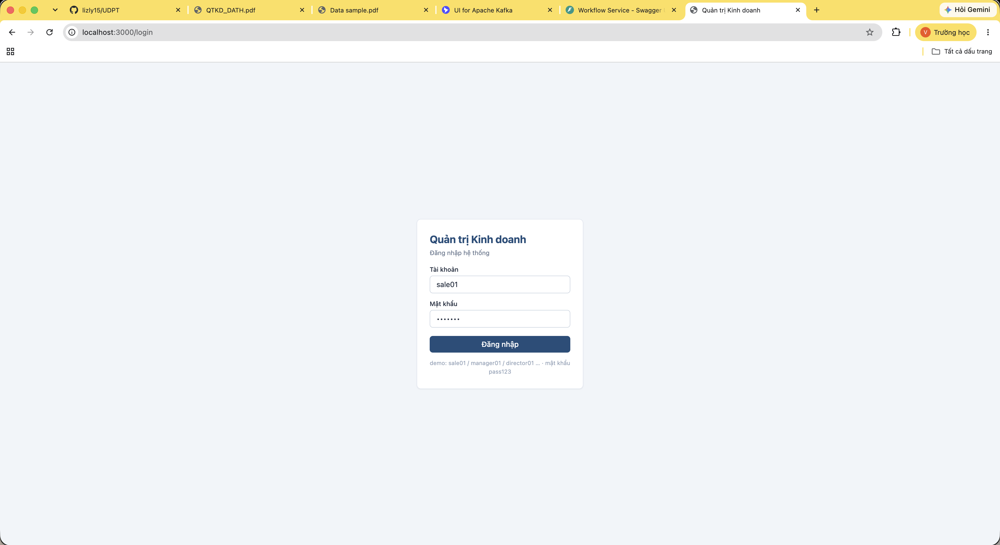
*Hình 7.1 — Đăng nhập (JWT).*

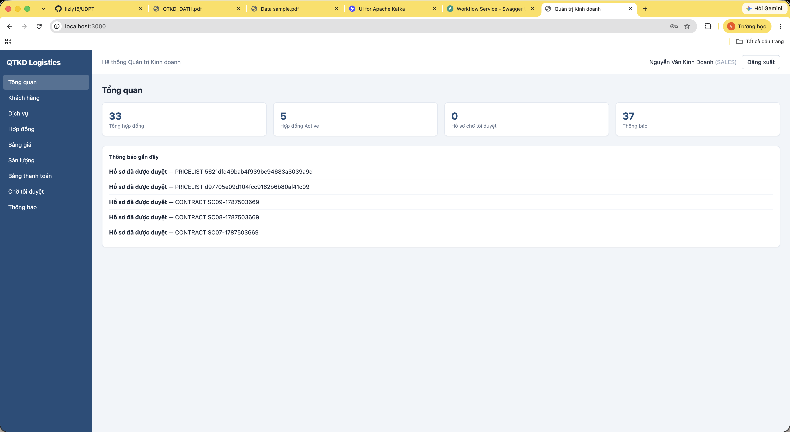
*Hình 7.2 — Trang tổng quan.*

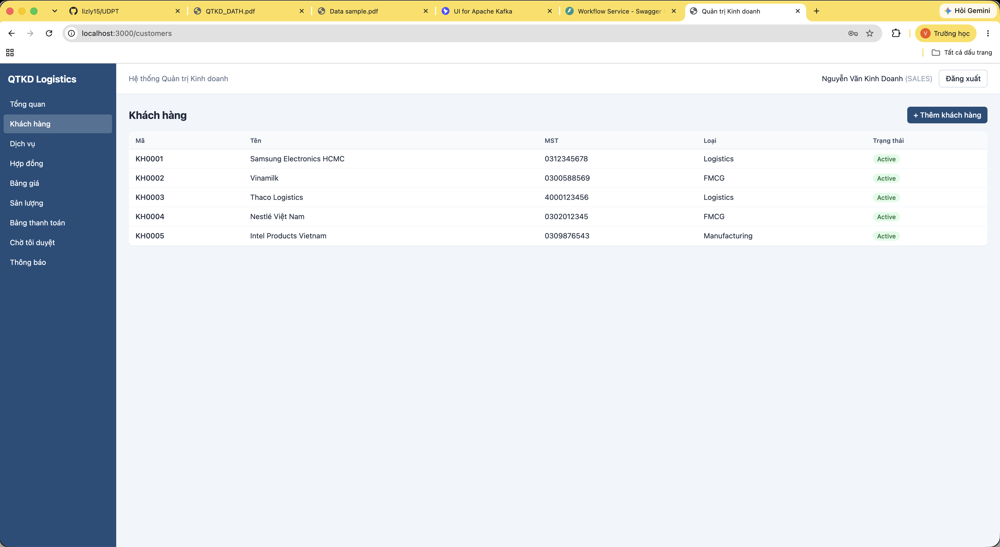
*Hình 7.3 — Quản lý khách hàng (4.1).*

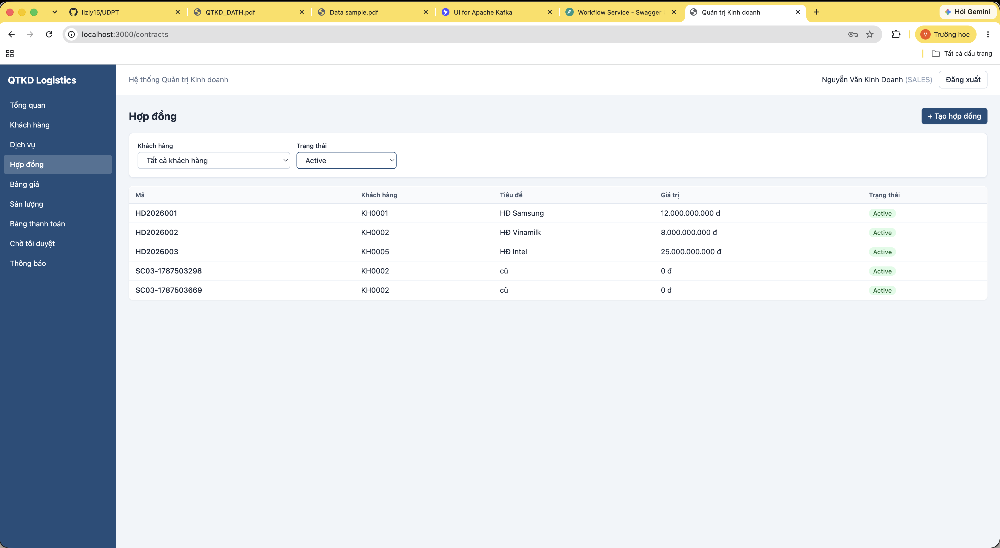
*Hình 7.4 — Danh sách hợp đồng có lọc theo trạng thái (4.2).*

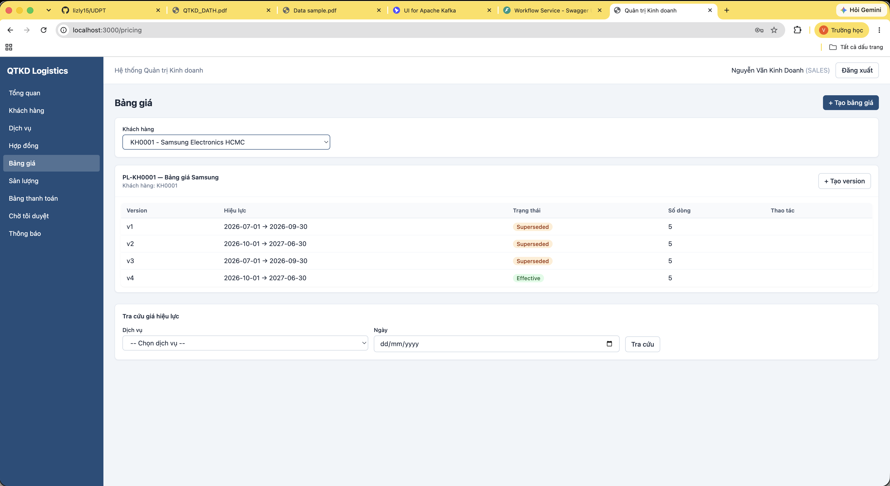
*Hình 7.5 — Bảng giá nhiều version, trạng thái Effective/Superseded (4.4).*

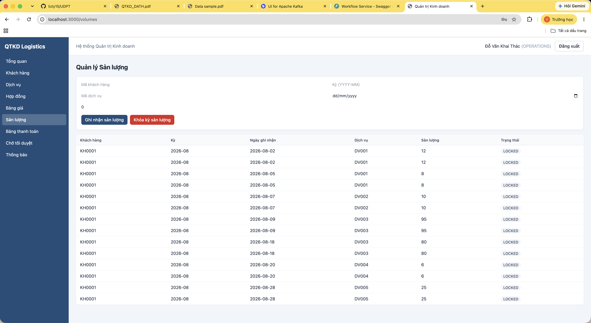
*Hình 7.6 — Sản lượng đã khóa kỳ (4.5).*

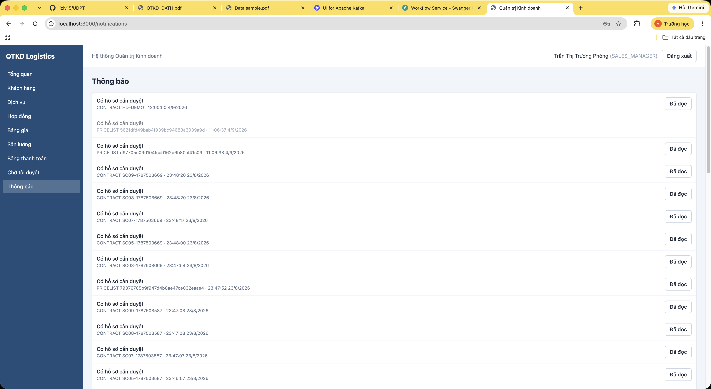
*Hình 7.7 — Thông báo bất đồng bộ (4.9).*

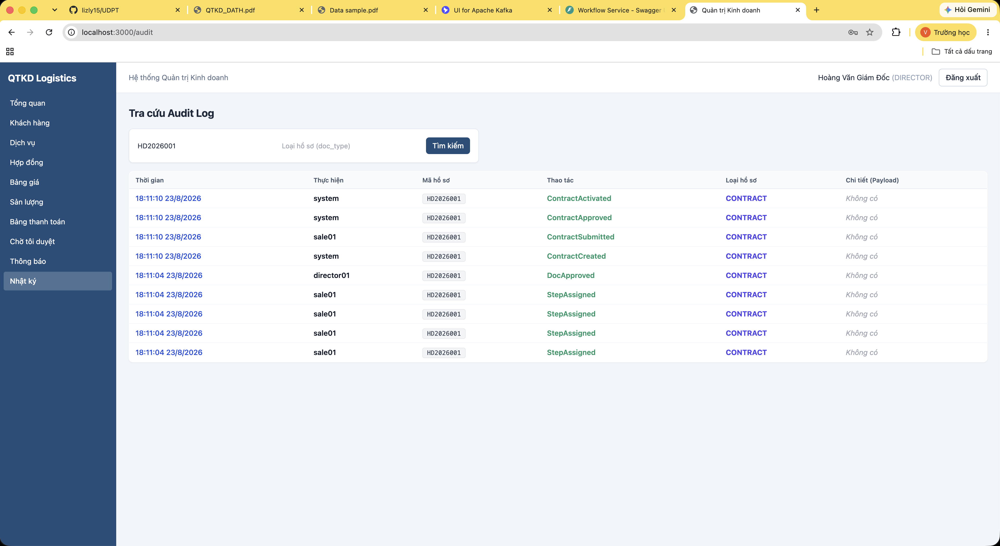
*Hình 7.8 — Nhật ký truy vết theo hồ sơ (4.10).*

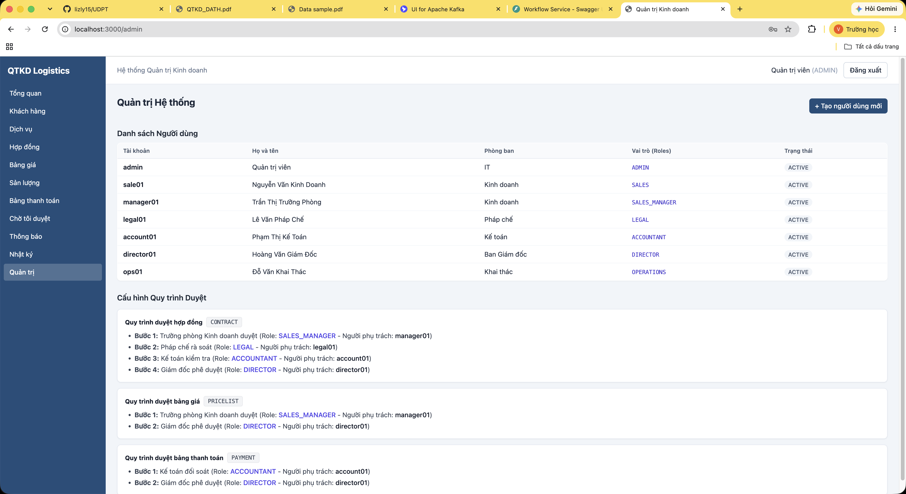
*Hình 7.9 — Quản trị người dùng và cấu hình quy trình duyệt (workflow data-driven).*

## 8. Xử lý bài toán phân tán (điểm nhấn kỹ thuật)

| Vấn đề | Giải pháp | Vị trí |
|---|---|---|
| **Quy trình duyệt không hard-code** | Engine đọc định nghĩa quy trình từ DB | `workflow-service/services/engine.py` |
| **Double submit** (SC-09) | `Idempotency-Key` (Redis) + instance duy nhất | api-gateway, engine |
| **Race condition khi duyệt** (SC-05) | Optimistic locking `version_id` → 409 | `WorkflowInstance` |
| **Mất event** | **Outbox Pattern**: ghi DB + outbox cùng transaction | `common/outbox.py` |
| **Phân quyền theo ngữ cảnh** (SC-08) | Kiểm tra đúng **assignee**, không chỉ role | `engine.act` |
| **Dữ liệu lịch sử** (SC-04/10) | Chọn bảng giá theo ngày + copy đơn giá cứng | pricing, billing |
| **Service phụ lỗi** (SC-07) | Async + Outbox: nghiệp vụ chính không hỏng | Kafka + consumer idempotent |

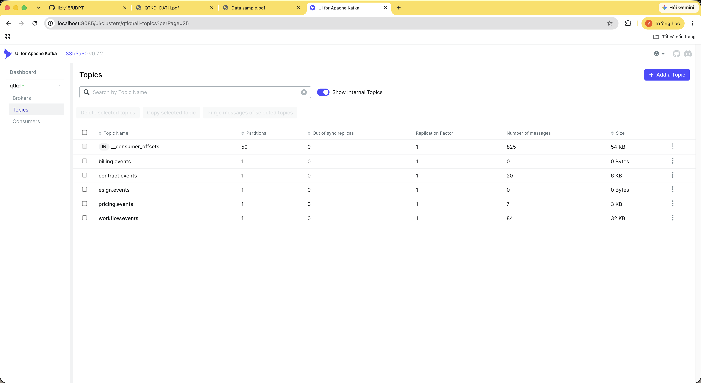
*Hình 8.1 — Các topic sự kiện trên Kafka.*

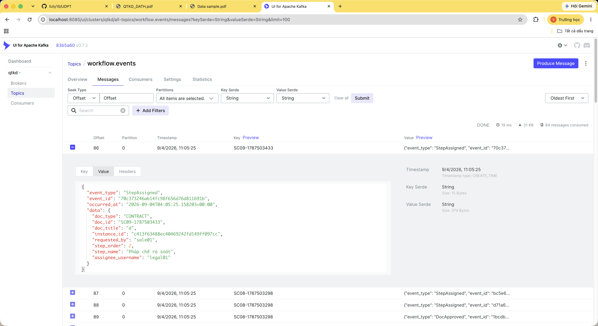
*Hình 8.2 — Event thật (StepAssigned, DocApproved…) phát qua Outbox, có event_id/occurred_at.*

## 9. Business rules & sơ đồ trạng thái

Hợp đồng (CTR-01..07), Bảng giá (PRC-01..06), Bảng thanh toán (PAY-01..07), Phê duyệt & ký (APR-01..07) được enforce trong tầng service. Chi tiết mapping rule ↔ code: `docs/business-rules.md`.

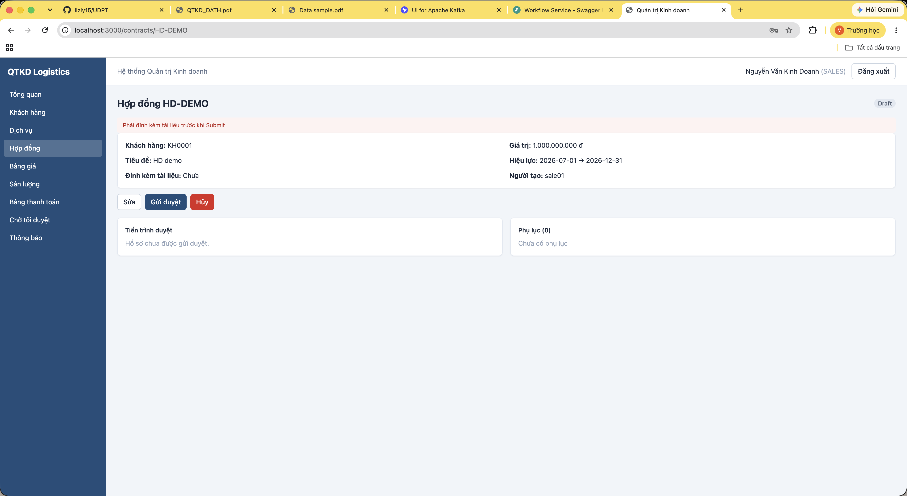
*Hình 9.1 — CTR-02/SC-01: không cho gửi duyệt hợp đồng khi chưa đính kèm tài liệu.*

## 10. Triển khai

**Mã nguồn:** <https://github.com/lizly15/UDPT>

**Docker Compose (dev):** `make up` dựng toàn bộ 14 container; `python3 scripts/seed.py` nạp dữ liệu mẫu A.1–A.8.

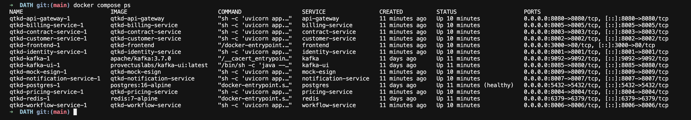
*Hình 10.1 — 14 container chạy độc lập qua Docker Compose.*

**Kubernetes (minikube):** manifests tại `k8s/` (namespace, config, hạ tầng, 9 service). Triển khai và chạy thành công:

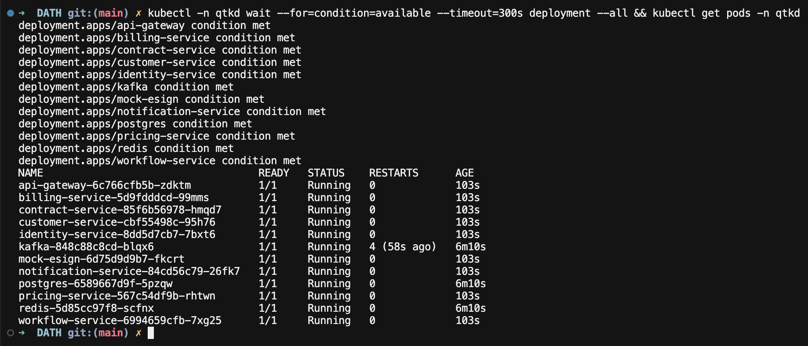
*Hình 10.2 — Toàn bộ pod ở trạng thái Running trên cụm Kubernetes (minikube).*

## 11. Kiểm thử & minh chứng

- **Seed tái tạo chính xác Phụ lục A.8**: bảng thanh toán tháng 08/2026 = **50.500.000đ**, trạng thái Issued (đã ký) — xem Hình 6.5.
- **Smoke test kịch bản nghiệp vụ** (`scripts/smoke-test.sh`): **14/14 assertion PASS** cho SC-01..SC-10.
- **Unit test** (`make test`): **31/31 PASS** cho state machine & business rule.

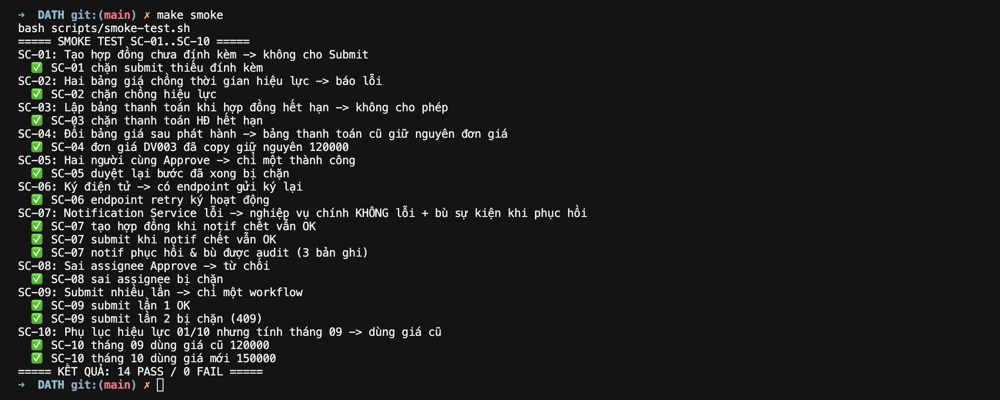
*Hình 11.1 — Smoke test SC-01→SC-10: 14 PASS / 0 FAIL.*

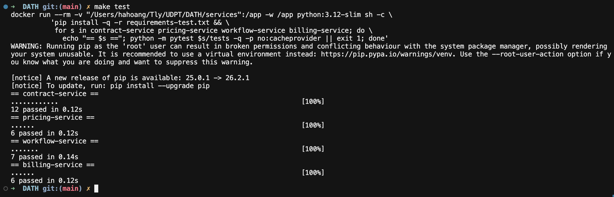
*Hình 11.2 — Unit test (pytest): 31 test PASS trên 4 service.*

## 12. Bảng truy vết yêu cầu

### 12.1. Chức năng nghiệp vụ (mục 4)

| Yêu cầu | Service | Endpoint chính | Minh chứng |
|---|---|---|---|
| 4.1 Quản lý khách hàng | customer | `/customers`, `PATCH /customers/{code}/status` | Hình 7.3 |
| 4.2 Quản lý hợp đồng | contract | `/contracts`, `/submit`, `/activate`, `/cancel` | Hình 6.2, 7.4 |
| 4.3 Phụ lục hợp đồng | contract | `/contracts/{code}/appendices` | Hình 6.2 |
| 4.4 Bảng giá + version | pricing | `/pricing/lists`, `/versions`, `/effective` | Hình 7.5 |
| 4.5 Sản lượng + khóa kỳ | billing | `/volumes`, `/volumes/lock` | Hình 7.6 |
| 4.6 Bảng thanh toán | billing | `/payments/generate`, `/submit` | Hình 6.5 |
| 4.7 Quy trình duyệt (không hard-code) | workflow | `/workflows/instances`, `/tasks/*` | Hình 6.3, 7.9 |
| 4.8 Ký điện tử (async) | workflow + mock-esign + billing | `/internal/esign/callback`, `/esign/retry` | Hình 6.4, 6.5 |
| 4.9 Thông báo (async) | notification | `/notifications` | Hình 7.7 |
| 4.10 Nhật ký & truy vết | notification | `/audit` | Hình 7.8 |

### 12.2. Business rules & sơ đồ trạng thái (mục 5)

| Nhóm | Mã rule | Nơi hiện thực |
|---|---|---|
| Hợp đồng | CTR-01..07 | `contract-service/services/logic.py` |
| Bảng giá | PRC-01..06 | `pricing-service/services/logic.py` |
| Bảng thanh toán | PAY-01..07 | `billing-service/services/logic.py` |
| Phê duyệt & ký | APR-01..07 | `workflow-service/services/engine.py`, `esign.py` |
| Double submit / Race / Mất event / Ngữ cảnh / Lịch sử | mục 5.5 | Idempotency, optimistic lock, Outbox, assignee-check, copy đơn giá |

### 12.3. Kịch bản kiểm thử (Phụ lục A.12) — `scripts/smoke-test.sh`

| Mã | Kịch bản | Kết quả mong đợi | Trạng thái |
|---|---|---|---|
| SC-01 | Tạo HĐ chưa đính kèm | Chặn submit (`NO_ATTACHMENT`) | ✅ PASS |
| SC-02 | Hai bảng giá chồng hiệu lực | `EFFECTIVE_OVERLAP` | ✅ PASS |
| SC-03 | Thanh toán khi HĐ hết hạn | `CONTRACT_EXPIRED` | ✅ PASS |
| SC-04 | Đổi bảng giá sau phát hành | Đơn giá đã copy giữ nguyên | ✅ PASS |
| SC-05 | Hai người cùng Approve | Chỉ một thành công (optimistic lock) | ✅ PASS |
| SC-06 | Ký điện tử FAILED | Cho gửi ký lại (`/esign/retry`) | ✅ PASS |
| SC-07 | Notification Service lỗi | Nghiệp vụ chính OK + bù event khi phục hồi | ✅ PASS |
| SC-08 | Sai assignee Approve | Từ chối (`NOT_ASSIGNEE`) | ✅ PASS |
| SC-09 | Submit nhiều lần | Chỉ một workflow | ✅ PASS |
| SC-10 | Phụ lục 01/10 nhưng tính tháng 09 | Dùng giá cũ | ✅ PASS |

→ **14/14 assertion PASS** (Hình 11.1). Chi tiết mapping mã lỗi ↔ code: `docs/requirements-traceability.md`, `docs/business-rules.md`.

### 12.4. Yêu cầu kỹ thuật (mục 6)

| Yêu cầu | Hiện thực | Minh chứng |
|---|---|---|
| Microservices ≥4 service nghiệp vụ + API Gateway | 6 service nghiệp vụ + gateway + identity + mock-esign | Hình 2.1, 10.1 |
| API Gateway điều phối + xác thực | `api-gateway` (proxy, JWT, rate-limit, idempotency) | Hình 2.1 |
| Backend FastAPI + OpenAPI/Swagger | FastAPI, `/docs` tự sinh mỗi service | Hình 5.1 |
| Mỗi service DB riêng | 1 PostgreSQL, 7 database riêng | Hình 4.1 |
| PostgreSQL / Redis / Kafka | Đủ; Kafka + Outbox Pattern | Hình 8.1, 8.2 |
| Docker Compose (dev) | `docker-compose.yml` (14 container) | Hình 10.1 |
| Kubernetes manifests (minikube) | `k8s/`, deploy thành công | Hình 10.2 |
| Logging, error handling, validation, JWT | Logging JSON, error chuẩn hóa, Pydantic, JWT + RBAC | Hình 7.1 |

## 13. Phân công công việc

**Vũ Huyền Thiên Lý (21126028) — 35% — Kiến trúc & phần lớn backend + báo cáo/slide:**

- Thiết kế kiến trúc microservices tổng thể & mô hình dữ liệu (DB-per-service).
- **API Gateway**: reverse proxy, verify JWT, rate-limit, idempotency.
- **Identity service**: đăng nhập, JWT access/refresh, RBAC 7 role, blacklist token.
- **Contract service**: hợp đồng + phụ lục, state machine CTR-01..07.
- **Pricing service**: bảng giá + version, PRC-01..06, tra giá theo ngày.
- **Workflow service**: engine phê duyệt data-driven, optimistic lock, điều phối ký điện tử (APR-01..07).
- **Notification/Audit service**: thông báo bất đồng bộ + nhật ký truy vết.
- **Thư viện dùng chung**: Kafka producer/consumer, **Outbox Pattern**, logging JSON, xử lý lỗi, helper JWT/RBAC.
- **Hạ tầng**: Docker Compose (PostgreSQL đa DB, Redis, Kafka), **Kubernetes** manifests (minikube).
- **Kiểm thử & dữ liệu**: seed dữ liệu mẫu A.1–A.8, smoke-test SC-01..10, unit test (pytest).
- **Báo cáo & slide thuyết trình.**

**Nguyễn Hoàng Danh (21126057) — 15% — Backend:**

- **Customer service**: quản lý khách hàng + danh mục dịch vụ.
- **Billing service**: ghi nhận sản lượng & khóa kỳ; lập bảng thanh toán + quản lý trạng thái (PAY-01..07).
- **Mock e-sign service**: dịch vụ ký điện tử giả lập, callback bất đồng bộ.

**Nguyễn Tuấn Kiệt (21126027) — 25% — Frontend (khung + nghiệp vụ Kinh doanh):**

- Khung ứng dụng React: định tuyến, xác thực, layout, API client (tự refresh token), bộ component dùng chung (bảng dữ liệu, modal, form, badge trạng thái, timeline duyệt).
- Màn **Khách hàng**; màn **Danh mục dịch vụ**.
- Màn **Hợp đồng**: danh sách + bộ lọc + tạo mới; chi tiết + phụ lục + tiến trình duyệt.
- Màn **Bảng giá**: danh sách version, tạo version, gửi duyệt, tra giá hiệu lực.

**Nguyễn Thế Thanh Long (22127247) — 25% — Frontend (Vận hành, Tài chính, Phê duyệt):**

- Màn **Sản lượng**: nhập sản lượng + khóa kỳ.
- Màn **Bảng thanh toán**: danh sách + lập bảng; chi tiết + gửi duyệt + trạng thái ký điện tử + gửi ký lại.
- Màn **Hộp thư phê duyệt**: duyệt / từ chối / yêu cầu chỉnh sửa.
- Màn **Thông báo**; màn **Nhật ký truy vết**.
- Màn **Quản trị**: quản lý người dùng + xem cấu hình quy trình duyệt.

## 14. Kết luận & hướng phát triển
Hệ thống đã hiện thực đầy đủ nghiệp vụ quản trị kinh doanh trên kiến trúc microservices, giải quyết trọn vẹn các bài toán phân tán trọng tâm (workflow cấu hình, Outbox, idempotency, optimistic locking, phân quyền ngữ cảnh, ký điện tử bất đồng bộ), triển khai thành công trên cả Docker Compose và Kubernetes, và được kiểm chứng bằng bộ test tự động (14/14 smoke + 31/31 unit).
**Hướng phát triển:** thay Outbox relay bằng CDC (Debezium), thêm distributed tracing (OpenTelemetry), HPA/PVC trên Kubernetes.
